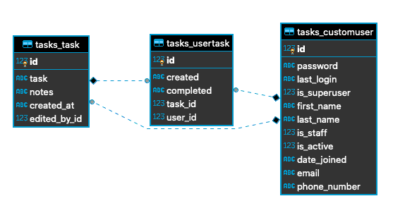

## Tasks Project  
Simple Learning project

## Tools Used
1. Python 3.7
2. Django 2.2.9
3. SQLite3 3.30.1
4. DBeaver 6.3.1

## Git Clone the project and cd into project 
Move to a working directory on your computer, and open terminal.   
`$: git clone git@github.com:diek/tasks-project.git`  
`$: cd tasks_project`  

## Create a venv and activate it  
`$: python3 -m venv _env`  
`$: source _env/bin/activate`  
`$: pip install --upgrade pip`  
`$: pip install -r requirements.txt`  

## Run migrations  
`$: python manage.py migrate tasks`  
`$: python manage.py migrate`  

## Load Initial Data  
`$: python manage.py loaddata user_data.json`  
`$: python manage.py loaddata task_data.json`    
`$: python manage.py loaddata user_task_data.json` 

## Generate Users via Management Commands
`$: python manage.py populate_users <int:number>`

## Generate User Tasks via Management Commands
`$: python manage.py populate_user_tasks <int:number>`

## ERD of Key Tables

## Acknowledments
The project includes code and concepts from:
- WS Vincent's [DjangoX project](https://github.com/wsvincent/djangox)
- Danny Greenfeld, et. al, [Cookiecutter Django](https://github.com/pydanny/cookiecutter-django)
- Michael Herman's Testdriven Blog - [Creating a Custom User Model in Django](https://testdriven.io/blog/django-custom-user-model/)
